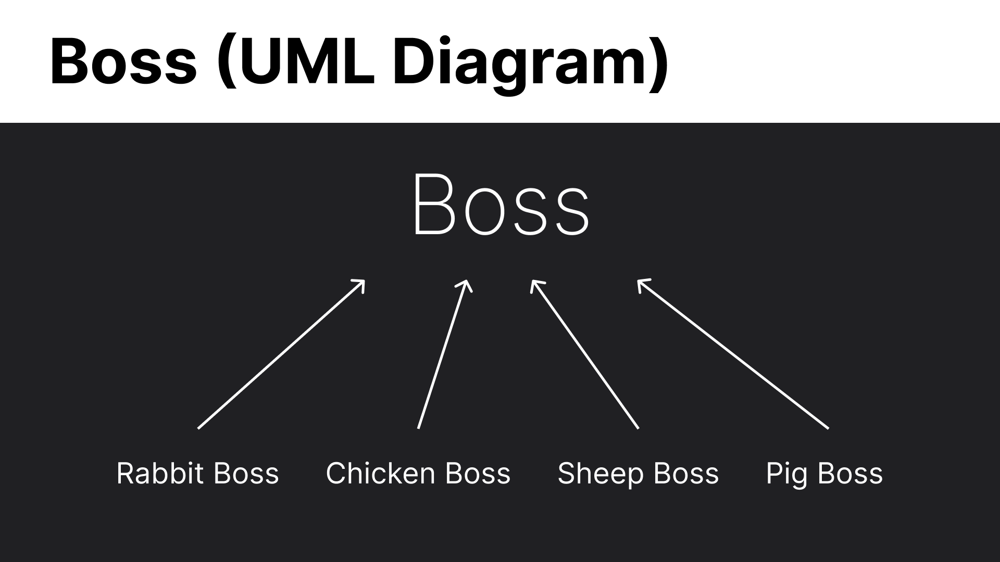
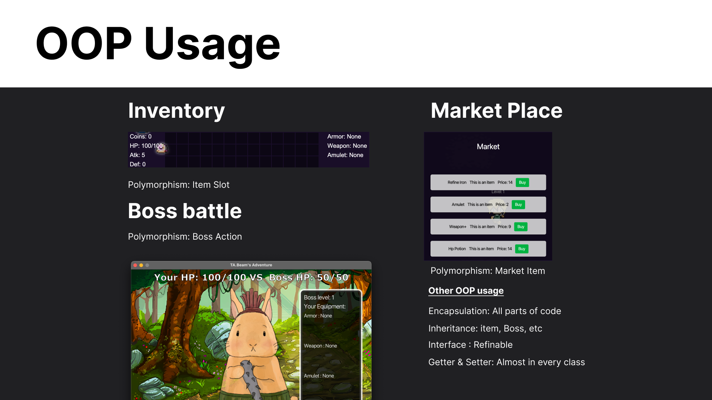
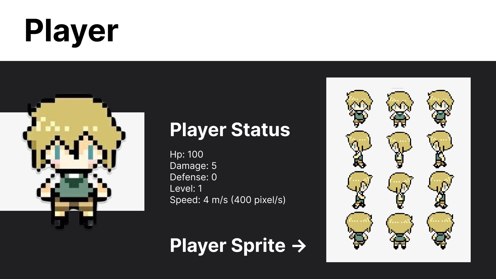
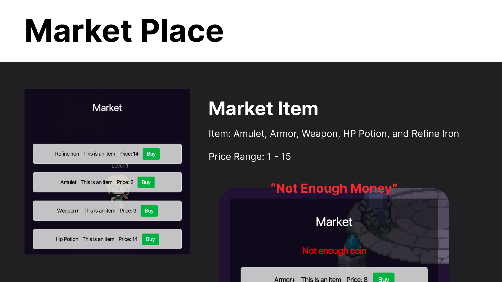

# TA Beam's Adventure

**Welcome to TA Beam's Adventure!**

**About**

Embark on an exciting journey with TA Beam in this pixelated adventure! Start your quest by farming for coins in the tranquil fields, battling slimes to earn your keep. Use your hard-earned coins to equip yourself with powerful weapons and armor, preparing for the challenges that lie ahead.

**Gameplay**

**Farming:**

* Begin your adventure in the peaceful farming area.
* Engage in combat with slimes to earn coins.
* Collect coins to purchase essential items like weapons and armor.

**Warp Gate:**

* Once you've gathered enough resources, venture to the mysterious warp gate.
* Step through the portal to be transported to a random encounter with a formidable boss monster.

**Boss Battles:**

* Prepare for intense rock-paper-scissors battles against powerful bosses.
* Strategically choose your moves to defeat each boss and progress further.

**Features**

* Pixelated graphics for a nostalgic gaming experience.
* Engaging farming gameplay with slime encounters.
* Challenging boss battles with rock-paper-scissors mechanics.
* A variety of items to collect and equip.

**Controls**

* Press WSAD on keyboard to walk
* Press M to go to market
* Press 1,2,3 to wear armor,weapon,and amulet respectively 
* Mouse Click at a slime to kill

**Enjoy your adventure with TA Beam!**
